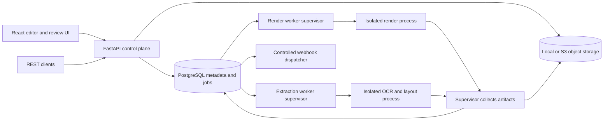

# Proposed technology stack

Date: 2026-09-22. Status: architectural proposal. E1 now has foundation code; see [implementation status](e1-foundation.md). The broader stack remains unimplemented and unbenchmarked. Traceability: [original backlog](epics.md), [decision register](design-decisions.md), [delivery plan](implementation-plan.md).

## Product interpretation

This is a self-hosted document platform with two connected workflows: structured data to multilingual documents, and incoming documents to reviewed structured data. Its differentiator is demonstrably correct complex-script output, with source provenance throughout extraction and review. A generic form builder or an LLM wrapper would not satisfy the backlog.

The source specifies PostgreSQL (E1-04), Docling (E8-03), PaddleOCR (E8-04), CPU-only operation (E1-06), local extraction without external calls (E9-03), PDF and Word workflows, and no network access from templates (E11-04). These are requirements, not optional technology preferences. Hosted billing is R4; AI assistance and MCP are R3. No cloud or model provider is required for MVP.

## Recommended architecture

Use a modular Python backend and a React browser application, with separate worker processes for untrusted rendering and extraction. Keep one repository and shared contracts. Avoid splitting each epic into a network service. Process isolation is needed for document execution even while business modules remain together.

Supervisors fetch only authorized inputs and upload results. Sandboxed child processes have no database credentials, storage credentials or network access. Webhook delivery and allow-listed asset fetching happen in separate, controlled paths. Synchronous API calls wait for the same job machinery under a bounded timeout; they do not bypass isolation.

## Stack by layer

Choices below are architectural recommendations. At implementation, select mutually compatible supported releases, pin dependencies and container digests, and record licence evidence for the entire dependency graph. No version has been selected merely because it is installed on this workstation.

| Layer | Proposal | Fit and limits | Epics |
| --- | --- | --- | --- |
| Browser application | React, TypeScript, Vite; React Router and TanStack Query | Interactive self-hosted SPA; no MVP requirement for SSR. Strict types and generated API types reduce contract drift. | E2, E3, E10, E14 |
| Rich text and layout editor | ProseMirror inside a custom DOM-based page/block editor; CSS logical properties | Preserve browser text input, bidi selection and IME. ProseMirror is not a complete paginated template designer: block flow, repeated tables, snapping and pagination remain product engineering. | E2, E4 |
| UI styling and localization | CSS variables/tokens, accessible HTML controls, i18next/react-i18next | Establish translated message keys from day one; separate product UI locale from template content locale. | E2, E10, E14 |
| Document preview/review | PDF.js plus an overlay layer for bounding boxes | Final preview uses the generated PDF. Coordinate transformations must handle page rotation and zoom. [PDF.js project](https://github.com/mozilla/pdf.js). | E2, E8, E10 |
| API/domain | Python, FastAPI, Pydantic; REST and generated OpenAPI | Python aligns with OCR/layout tooling. FastAPI supports OpenAPI and validation; domain schemas still need explicit versioning. [FastAPI features](https://fastapi.tiangolo.com/features/). | E1, E3, E7, E9 |
| Persistence | PostgreSQL; SQLAlchemy and Alembic | Relational integrity for versions, jobs and reviews; JSONB for validated document trees and extraction payloads. PostgreSQL is explicitly required. | E1, E3, E9, E10 |
| Jobs | PostgreSQL-backed leased jobs with transactional enqueue and distinct render/extraction queues | Fewer MVP services; requires real lease, retry and restart tests. Use short row-claim transactions with `FOR UPDATE SKIP LOCKED`, not a long database transaction around OCR. [PostgreSQL SELECT](https://www.postgresql.org/docs/current/sql-select.html). | E7, E12 |
| File storage | Storage interface with local disk and S3-compatible adapters, using boto3 for S3 | Local backend is the default Compose experience. User-supplied S3 endpoints stay optional. Do not mandate a bundled object-store server. | E1, E3, E7 |
| Designer PDF | First candidate: pinned Chromium controlled by Playwright; compare WeasyPrint | Print CSS is a useful starting point, not proof of table pagination, glyph coverage, metadata or script correctness. [Playwright PDF API](https://playwright.dev/docs/api/class-page#page-pdf), [WeasyPrint](https://github.com/Kozea/WeasyPrint). | E2, E4, E6 |
| Word merge | python-docx-template with a restricted, validated placeholder/loop grammar | Preserves a separate Word-template path. Reject unrestricted expressions and external relationships; library templating is not the security boundary. [docxtpl documentation](https://docxtpl.readthedocs.io/en/latest/). | E5, E6 |
| Word to PDF | Isolated headless LibreOffice, conditional on dependency-policy resolution | Test against Word-authored fixtures. Conversion fidelity cannot be guaranteed for arbitrary documents. Its licence is outside the current default allow-list. [LibreOffice licences](https://www.libreoffice.org/licenses/). | E6 |
| Fonts and formatting | Bundled selected Noto families including a separate CJK set; explicit fallback manifests; locale formatting adapter | Track font files and hashes. Babel/CLDR is a candidate formatter but its licence also needs review; exact locale outputs require fixtures. [Noto repository](https://github.com/notofonts/noto-fonts), [Babel repository](https://github.com/python-babel/babel). | E4, E5 |
| Layout/OCR | Docling for document layout; PaddleOCR language packs for scans; Tesseract as third adapter | Matches named requirements and E8-08's third-engine requirement. Engines have different capabilities; a shared result model must report gaps rather than fabricate layout or confidence. [Docling](https://docling-project.github.io/docling/), [PaddleOCR](https://github.com/PaddlePaddle/PaddleOCR), [Tesseract](https://github.com/tesseract-ocr/tesseract). | E8 |
| Schema extraction | JSON Schema, deterministic local label/region/table extraction; Python Decimal for monetary values | Bundle invoice, receipt and purchase-order mappings. Broader document generalization must be measured; do not assume OCR text equals validated fields. Provider/model adapters remain optional. | E5, E9 |
| Identity | Local accounts, Argon2id password hashing, server-side sessions, scoped hashed API keys | Secure cookies, CSRF protection, login limits and permission checks in the API. OIDC/SAML is R2, not an MVP identity-server dependency. Exact auth libraries selected with licence review. | E7, E11 |
| Deployment | Docker Compose, separate API and worker containers, documented TLS reverse proxy; Helm in R2 | CPU-first reference deployment. Model/font manifests enable the R2 offline bundle. Docker alone is not a complete document sandbox. | E1, E11, E12 |
| Verification | pytest, Vitest, Testing Library, Playwright, accessibility automation and manual review | Contract, restart, hostile-input, visual and extraction benchmark fixtures. Native-speaker checks are required; automated browser engines alone do not prove Safari support. | All |
| Operations | Structured redacted logs and correlation IDs initially; OpenTelemetry, Prometheus and dashboards in R2 | Keep document text out of telemetry. Dashboard implementation and full tracing remain R2. Final tool and container licences must be checked. | E12 |

[ProseMirror's project](https://github.com/ProseMirror/prosemirror) provides editor building blocks; adopting it does not establish that the bespoke template-editor requirements are already solved.

## Contracts that should be designed first

- **TemplateDefinition:** versioned JSON document tree containing page settings, flow blocks, text runs, styles, tables, bindings, condition/loop nodes, translation keys and immutable asset references. Do not persist arbitrary executable HTML as the canonical template. Carry an explicit renderer capability/version field even before user-selectable engine pinning arrives in R2.
- **Expression grammar:** bounded paths, literals, comparison/boolean operations and approved formatting functions. No `eval`, arbitrary Python/JavaScript, imports, filesystem or network calls. Cap nesting, iterations, string length and output size. Validate the same semantics in preview and generation.
- **PageModel:** schema version, document hash, engine/model versions, page index, dimensions, rotation, coordinate system, reading order, text spans, polygons/boxes and tables. Keep transformations from source coordinates explicit. Do not present Markdown as retaining all positional information: JSON is authoritative, with element IDs linking Markdown back to it.
- **ExtractionResult:** schema version, original value, normalized value, source spans/boxes, OCR score, calibrated extraction score, validation findings and review status. Unknown values remain missing or explicitly unknown. Calibration evidence belongs to a labelled held-out corpus.
- **RenderRequest/Result:** immutable template version, input data, locale, missing-field policy, font/engine versions, outputs and diagnostics. Published version is default; draft rendering requires authorization.
- **Job:** queued/running/done/failed externally; internal lease owner, expiry, attempt counter, progress, timeout, input hash and artifact references. All state transitions are atomic and recorded.
- **Review/correction:** optimistic concurrency token, actor, timestamp, original/new values and source changes. Approved snapshots are immutable; corrections after approval create a new revision requiring reapproval before generation.

Initial entities: user, role, API key, session, folder, template, template version, asset, translation bundle, extraction schema/version, source document/page, extraction run/result, field provenance, review, correction, job/attempt, output and webhook delivery. Add indexes from measured query patterns, not an assumed need for Elasticsearch or a vector database.

## Reliability and security implications

Queue delivery is at least once. Worker crashes can cause another attempt; outputs therefore need deterministic job/attempt paths, atomic result publication and deduplicated side effects. A lease heartbeat plus expiry reclamation must recover abandoned work. Initial restart recovery is MVP; a managed retry UI, configurable backoff and a visible dead-letter queue remain R2. Do not label queue recovery as completion of public idempotency keys (E7-10, R2).

Stage input assets before execution. Fetch user-supplied URLs through an SSRF-resistant gateway with scheme/host/address validation, redirect revalidation and size/time limits. Renderer network access remains off. Enforce job CPU, memory, page count, wall time and output-size limits; terminate the whole process tree. Validate decompressed archive size and path traversal, reject macros/unsafe relationships, and support the optional scanning hook. Uploaded fonts and PDFs are untrusted parser inputs too.

Use one deployment/workspace in MVP; enforce roles and resource authorization there. Keep repository boundaries ready for future tenant scoping, but do not claim multi-tenant isolation before E15-01 adversarial tests. Hosted tenant identifiers, billing and regional routing need an R4 design, not a premature default SaaS service.

## Licence-policy conflict: an implementation gate

E11-05 and the quality bar allow only MIT, Apache-2.0 and OFL by default. E1-04 simultaneously requires PostgreSQL, which uses the separate [PostgreSQL License](https://www.postgresql.org/about/licence/). Python, browser binaries, native libraries, image layers and several otherwise suitable packages introduce additional licence identifiers. A direct-dependency-only check would miss this conflict.

Recommendation: retain the named PostgreSQL requirement and propose a documented exception policy for specific permissive licences and runtime components. Evaluate LibreOffice/MPL separately; an isolated service does not remove its distribution obligations. No exception is accepted by this document. Record exact SPDX expressions, versions, source links, redistribution notices and scope before adding dependencies. If the allow-list must remain literally unchanged, this stack cannot be declared compliant and the backlog needs reconciliation before distribution. The output product's licence and contribution agreement are also undecided (E14-02).

Produce an SBOM covering Python/JavaScript packages, native libraries, containers, fonts and model weights. Model-code licensing does not establish model-weight licensing. No dependencies have been installed as part of this planning task.

## Alternatives and why they are not the first proposal

| Alternative | Trade-off / reconsideration trigger |
| --- | --- |
| All Node.js backend | Shares frontend types, but still needs Python integration for the named document tools; choose only if team expertise outweighs the extra bridge. |
| Django + DRF | Strong auth/admin foundation; reasonable alternative if back-office CRUD dominates. FastAPI keeps the worker and API contracts focused, at the cost of assembling auth and administration. |
| Next.js | Useful for public content and SSR; neither is a primary MVP need. A static SPA is simpler to self-host with the Python API. |
| Full microservices / Kubernetes from day one | More deployment and tracing overhead before throughput is known; retain process isolation and add distributed boundaries only when justified. |
| Celery plus an external broker | More mature scheduling/retry capabilities but extra infrastructure and licensing review. Reconsider if a proven PostgreSQL queue implementation cannot meet restart and throughput tests. |
| Canvas-only text editing | Fine for graphics handles, but risky for IME, bidi editing and accessibility. Use browser text layout inside the designer. |
| pdfme or another prebuilt designer | Worth a bounded comparison, but no assumption that complex scripts, flow tables and keyboard use pass E2/E4. Future template importers remain E14-08. |
| WeasyPrint as default | Strong paged-document candidate; may win E4-01. Its typography/pagination results, deployment footprint and full licence graph must be compared empirically. |
| Commercial rendering/conversion engine | Could improve Word/PDF fidelity; creates cost, distribution and offline constraints that require a separate recorded choice. |
| Cloud-only OCR or LLM extraction | Conflicts with local CPU operation and no-external-call defaults. Optional adapters are appropriate after capability, privacy, cost and accuracy evaluation. |

## Validation before committing the stack

1. Compare Chromium and WeasyPrint on Arabic, Hebrew, Hindi, Tamil, Thai, Chinese and Japanese as required by E4-01; extend coverage to Korean for E4-05. Include mixed bidi punctuation/numbers, fonts, repeated table headers, long rows, page breaks and metadata.
2. Test editor caret, selection, copy/paste, IME composition and keyboard flows on the same scripts. A passing PDF does not imply a passing editor.
3. Exercise Word placeholder/table/image merging and isolated conversion on the corpus. Establish whether the tested subset meets E6-03; document unsupported constructs.
4. Establish CPU-only Docling/PaddleOCR/Tesseract compatibility, language-pack licences, page-model coverage, accuracy and peak memory. Choose dependency/runtime versions together based on this spike.
5. Measure realistic document classes, page counts, fonts and image sizes. Set latency, memory and throughput budgets only after the baseline. Do not invent hardware minimums or an accuracy percentage from the story estimates.
6. Resolve licence policy and project licensing; then lock the selected versions and publish an SBOM.

References above were consulted on 2026-09-22. They establish upstream capabilities; proposed architecture, service boundaries and suitability conclusions are project-specific engineering judgments. No rendering, OCR, performance or accessibility acceptance test has yet been run.
